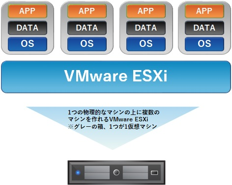

# VMware ESXi とは
VMware社が提供する仮想化ソフトウェアでです。 
これにより1台のサーバ（物理）上に複数の仮想サーバや仮想NW機器（NVA）を構築出来ます。 
AWSの場合にはXenという仮想化ソフトウェア、Azureの場合にはHyper-Vという仮想化ソフトウェアが用いられています。 
なお、これらの仮想化ソフトウェアは総称してハイパーバイザ製品と呼ばれることもあります。

## 前提条件
利用するバージョンに合わせてVMware社のドキュメントをご確認ください。 
Windwos10、GoogleChromeを利用した環境でキャプチャして作成しています。

## コンテンツ概要
VMware ESXi6.5上に仮想マシン（VM）を作成時の手順になります。 
作成した仮想マシン（VM）にWindows Server 2016をインストールしています。 
この状態のOSをゲストOSと呼ぶこともあります。

1. [Create VirtualMachine](https://github.com/kenchiman/VMwareESXi/tree/master/create-vm)
2. [indows Server 2016 Install](https://github.com/kenchiman/VMwareESXi/tree/master/guestos-install)