# 仮想マシン作成手順 on VMware ESXi

## 条件
VMware ESXi6.5で仮想マシンを作る手順を示します。 
※vCenterServerがない検証環境のためvCenterServerがある場合とは一部手順が異なる可能性があります。

## 仮想マシン作成手順
1. VMware ESXiがインストールされたサーバに接続します。 
   警告が表示されたら詳細をクリックします。

2. IPアドレスにアクセスする（安全ではありません）をクリックします。

3. ログイン画面が表示されたらユーザー名とパスワードを入力してログインします。
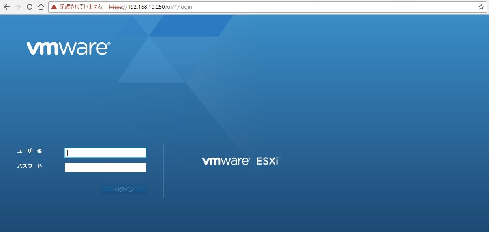
4. 「仮想マシンの作成/登録」をクリックします。
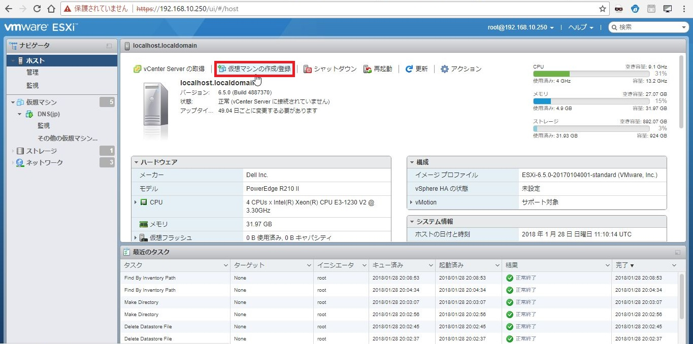
5. 仮想マシン作成ウィザードが立ち上がります。 
   「新規仮想マシンの作成」をクリックします。
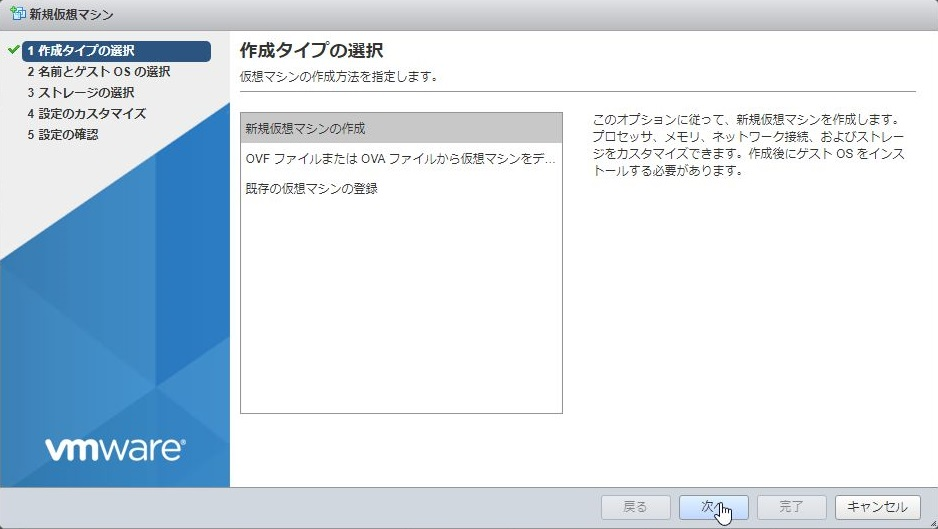
6. 「名前とゲストOSの選択」
    - 「名前」に仮想マシン名を入力します。
    - 「互換性」を選択することで古いESXiのバージョンで動いていた仮想マシンを動かせたりします。
    - 「ゲストOSファミリ」にてインストールするOSの種類で"Windows"を選択します。
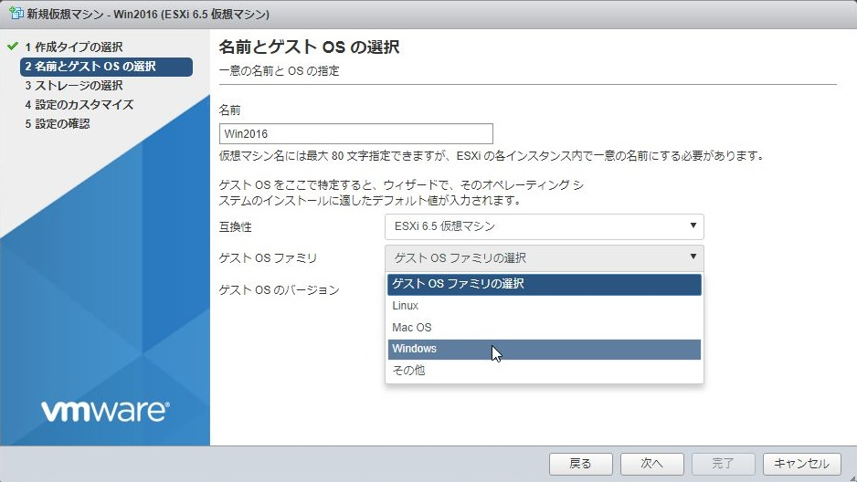
7. 「名前とゲストOSの選択」画面にて「ゲストOSのバージョン」から利用予定のバージョンをクリックします。 
   ※今回はWindows Server 2016（64bit）を選択します。
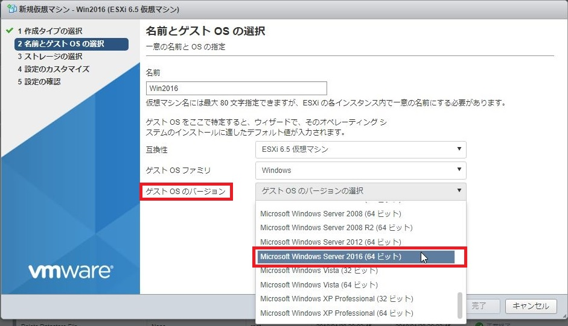
8. 「名前とゲストOSの選択」画面にて入力した内容を確認して「次へ」をクイックします。
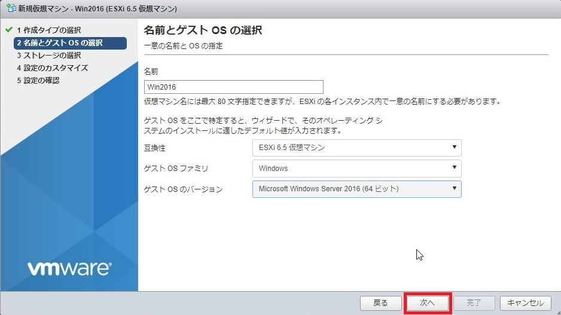
9. 「設定のカスタマイズ」にてCPUの数、メモリ搭載量などの設定をします。 
   これらは、各OSや利用予定のアプリケーションに必要な値にしてください。  
   ※Azureなどのクラウドサービスでは、"インスタンスサイズ","SKU"と呼ばれる部分に相当します。
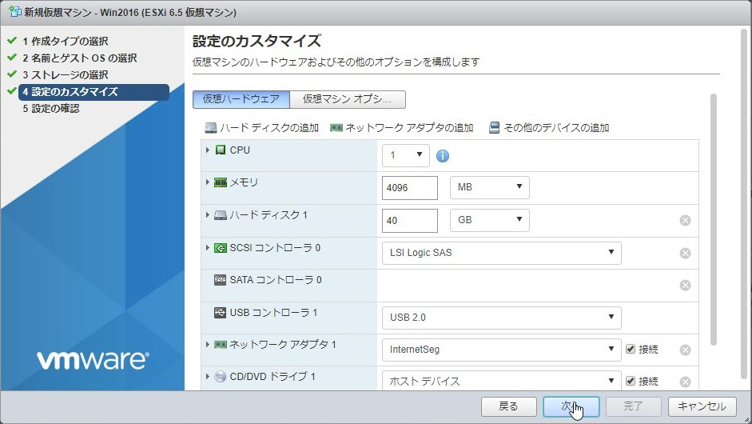
10. 「CD/DVDドライブ1」でデータストアを選択します。
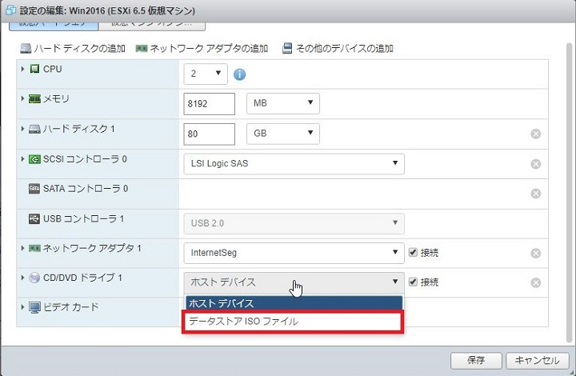
11. 「データストアブラウザ」が立ち上がるのでインストールする.isoファイルを選択します。 
    ※Windows Server 2016（64bit）用のISOファイルを選択します。
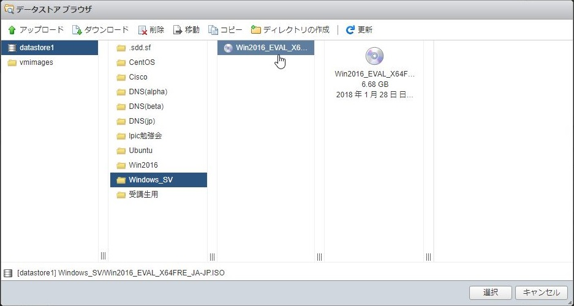
12. 「ネットワークアダプタの追加」をクリックするとNICを増設できます。（適宜）
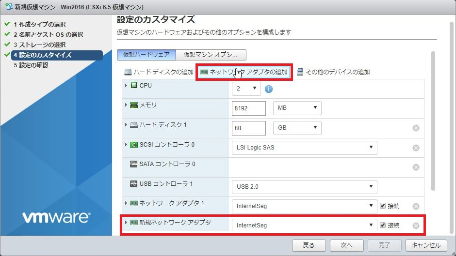
13. 「その他のデバイスの追加」をクリックすると様々なデバイスを増設できます。（適宜）
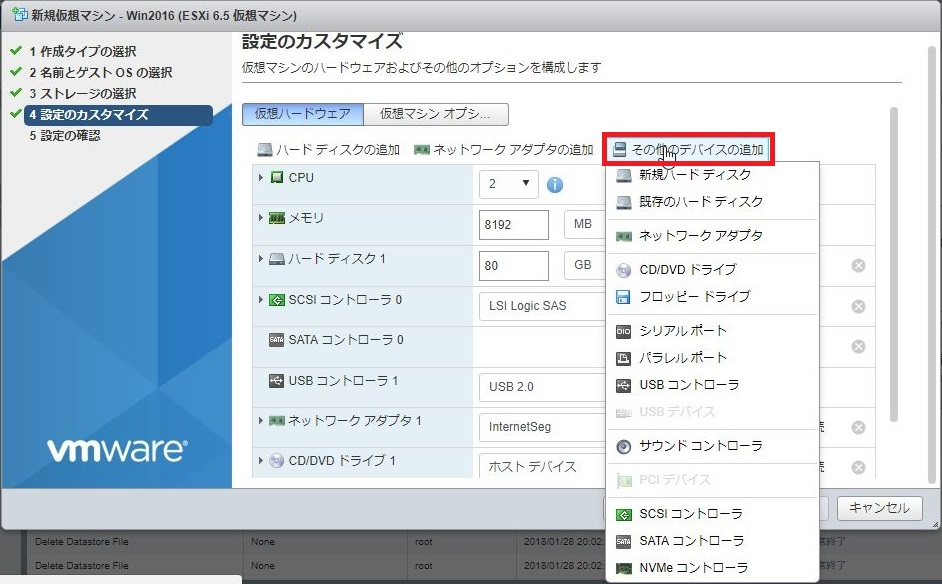
14. 「仮想マシンオプション」ボタンを選択すると起動オプションなどを変更できます。（適宜）
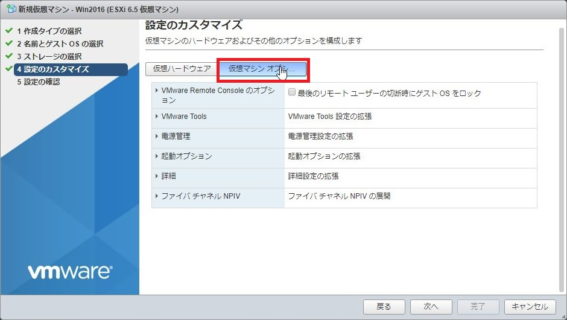
15. 「設定のカスタマイズ」の入力が完了したら「次へ」をクリックします。
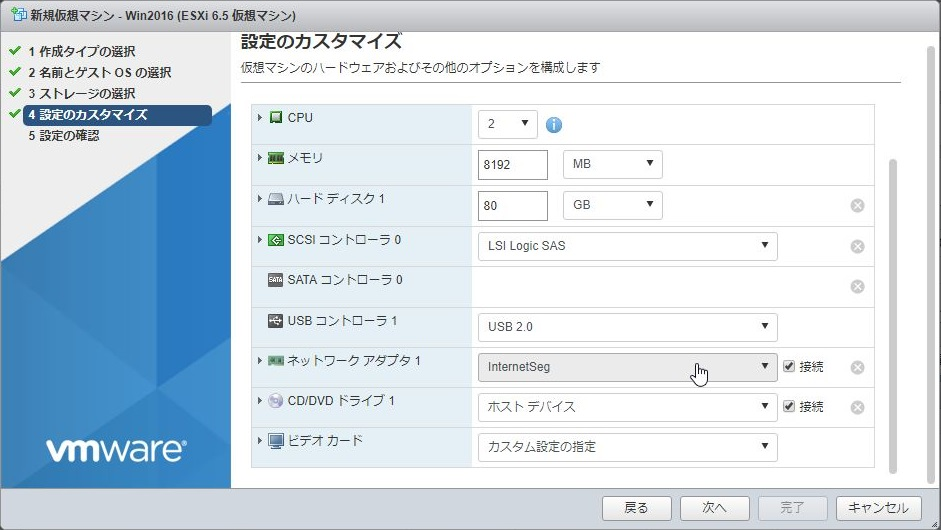
16. 「設定の確認」にて先程、設定したカスタマイズが合っているかを確認して「完了」をクリックします。
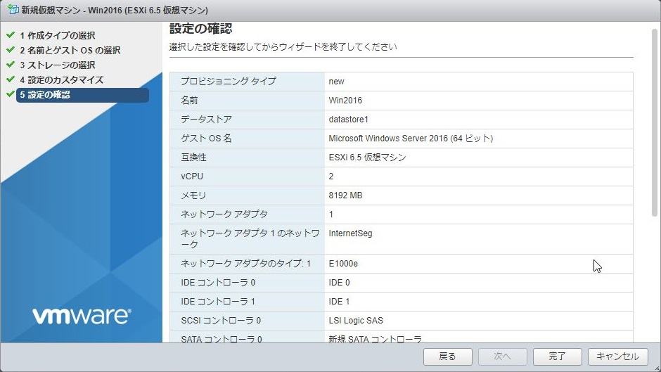
17. 仮想マシン一覧に作成した仮想マシンが存在することを確認します。
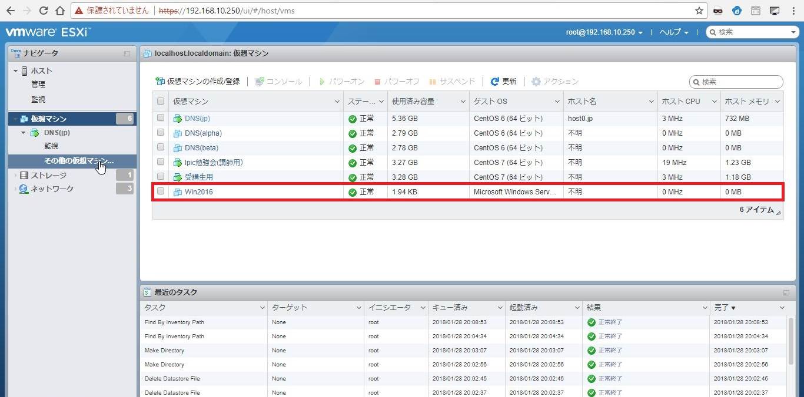

[Windows Server 2016 インストール手順](https://github.com/kenchiman/VMwareESXi/tree/master/guestos-install)