# Windows Server 2016 インストール手順

## 条件
VMware ESXi6.5に作成した仮想マシンにWindows Server 2016をインストールする手順を示します。

## インストール手順
1. VMware ESXiがインストールされたサーバに接続します。 
   警告が表示されたら詳細をクリックします。
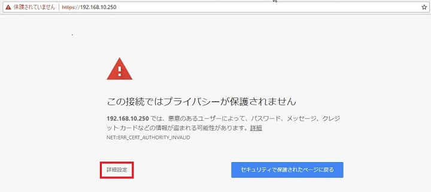
2. IPアドレスにアクセスする（安全ではありません）をクリックします。
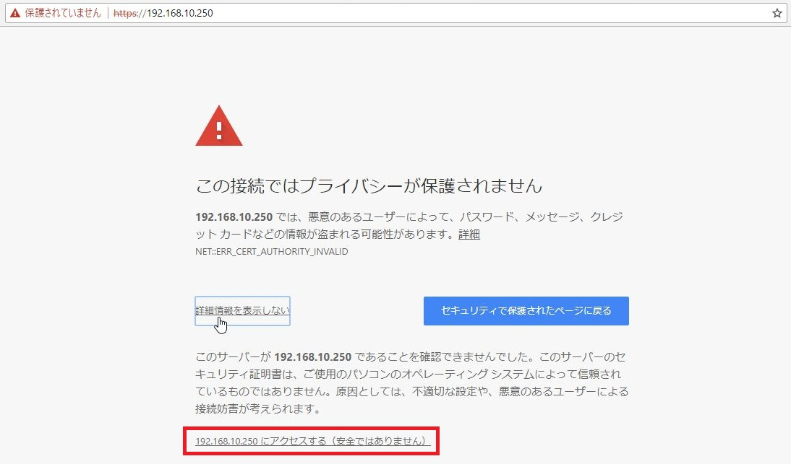
3. ログイン画面が表示されたらユーザー名とパスワードを入力してログインします。
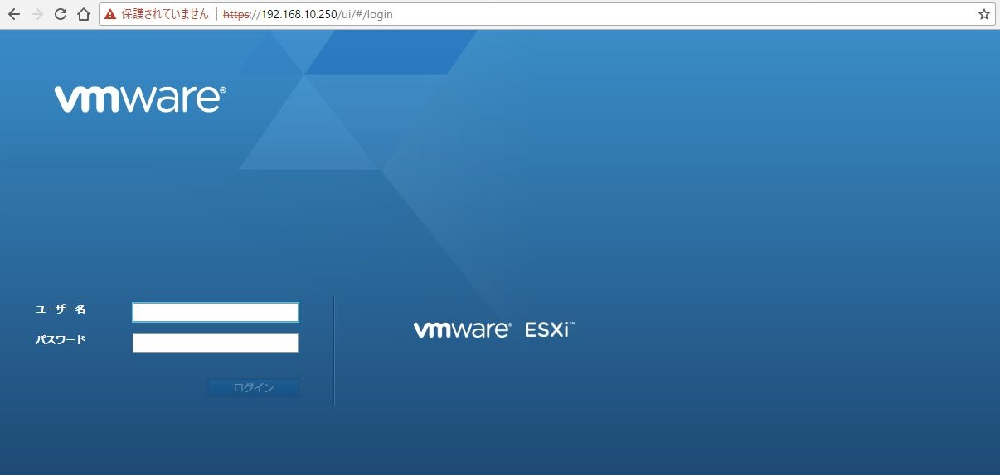
4. 仮想マシン一覧から起動したい仮想マシンをクリックします。
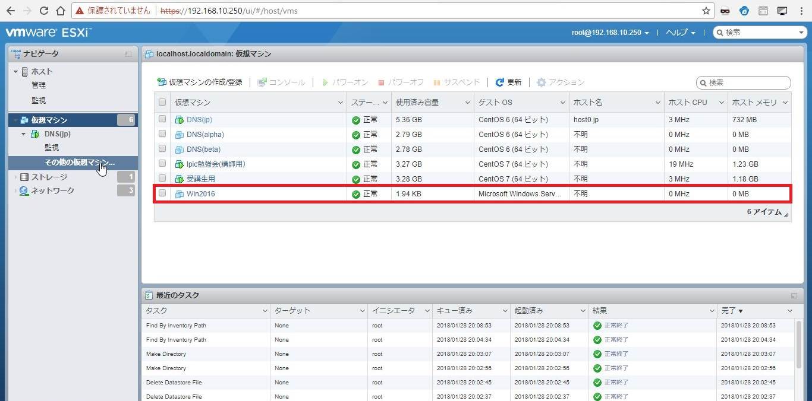
5. 「パワーオン」をクリックします。
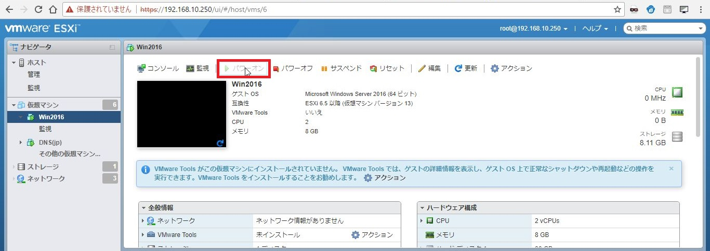
6. 「コンソール」ー「ブラウザコンソール」をクリックします。
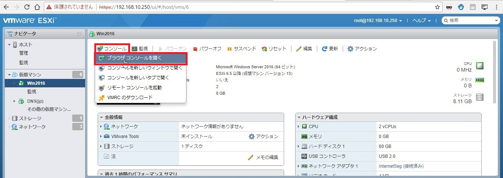
7. セットアップ画面が起動します。 
   下記の項目を設定して「次へ」をクリックします。
    - インストールする言語：日本語
    - 時刻と通貨の形式：日本語
    - キーボードまたは入力方式：Microsoft IME
    - キーボードの種類：日本語キーボード

8. 「今すぐインストール」をクリックします。
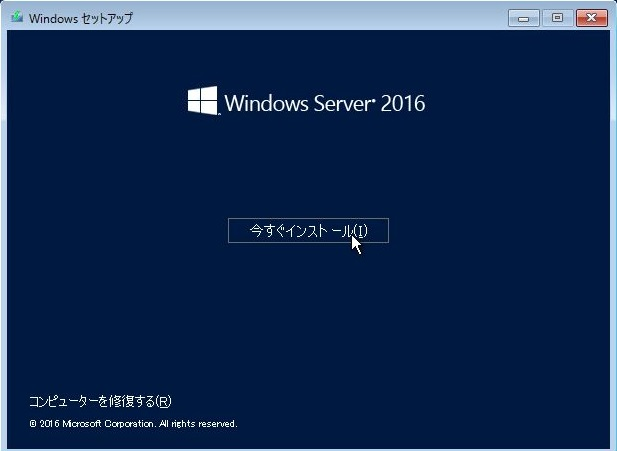
9. 	「セットアップを始めています」と表示されます。少し待ちます。

10. インストールするオペレーティングシステムをクリックして「次へ」をクリックします。
    - Windows Server 2016 Standard Evaluation
    - &#9758; Windows Server 2016 Standard Evaluation（デスクトップエクスペリエンス）
    - Windows Server 2016 Datacenter Evaluation
    - Windows Server 2016 Datacenter Evaluation（デスクトップエクスペリエンス）
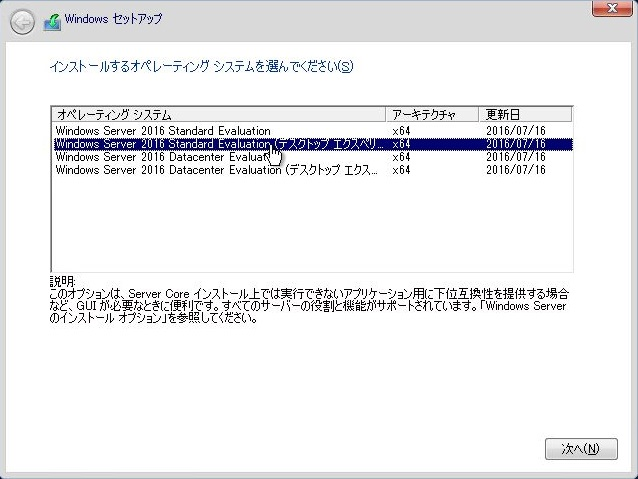
11. ライセンス条項を確認して「同意します」にチェックを入れて「次へ」をクリックします。
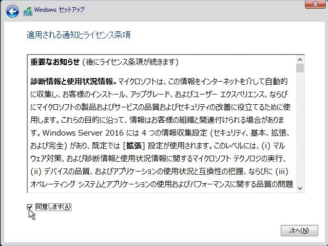
12. インストールの種類を選択します。
    - アップグレード
    - &#9758; カスタム

13. OSをインストールする領域をクリックして「次へ」をクリックます。
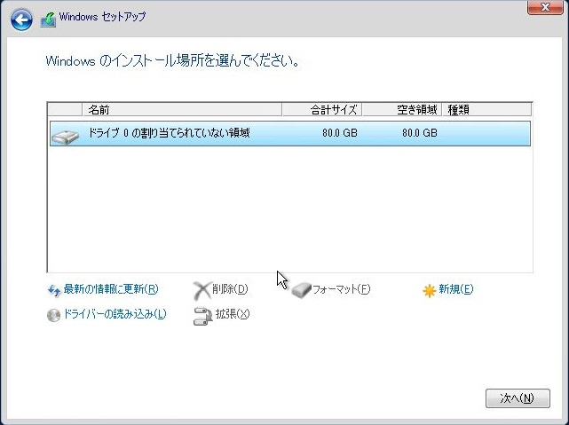
14. OSのインストールが始まります。
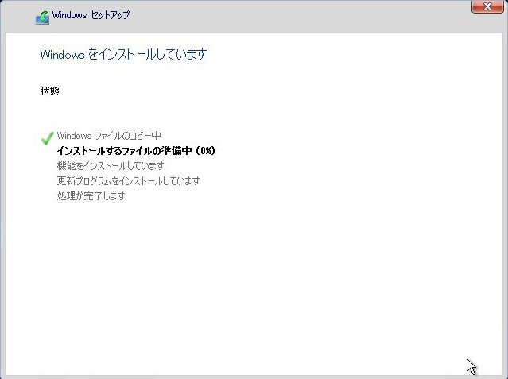
15. Administrator（管理者）のパスワードを設定します。 
    パスワードを設定したら「完了」クリックします。

16. インストールが完了するとログイン画面が表示されます。 
    画面中央上を右クリックして「キーボードレイアウト」－「日本語」をクリックします。

17. 画面中央上を右クリックして「ゲストOS」－「キーの送信」ー「Ctrl+Alt+Delete」をクリックします。
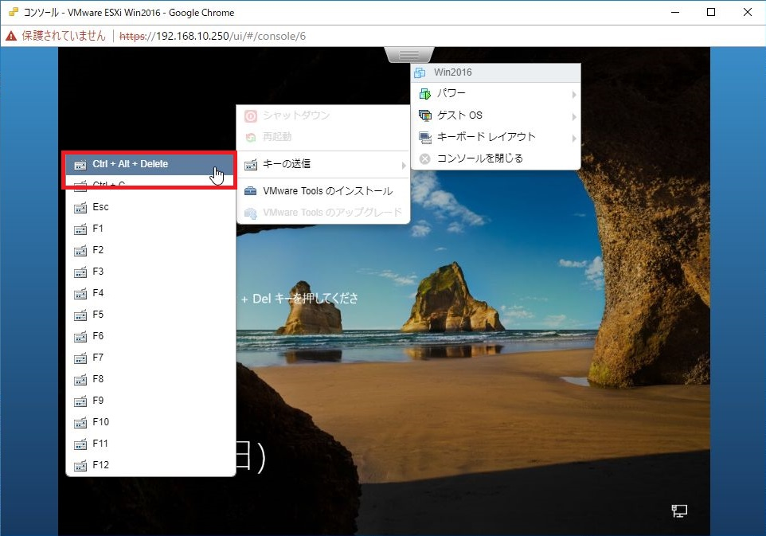
18. Administratorのパスワードを入力してログインします。